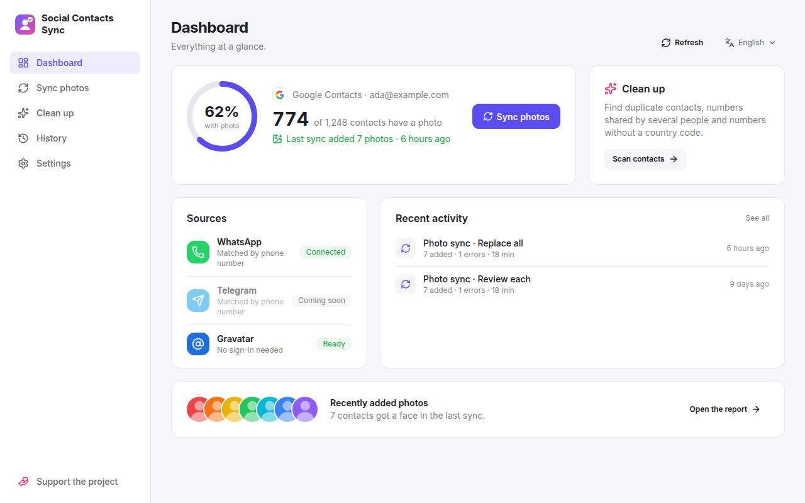
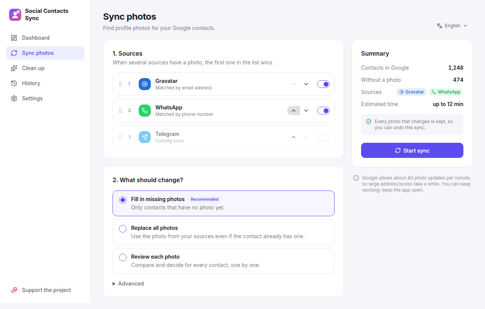
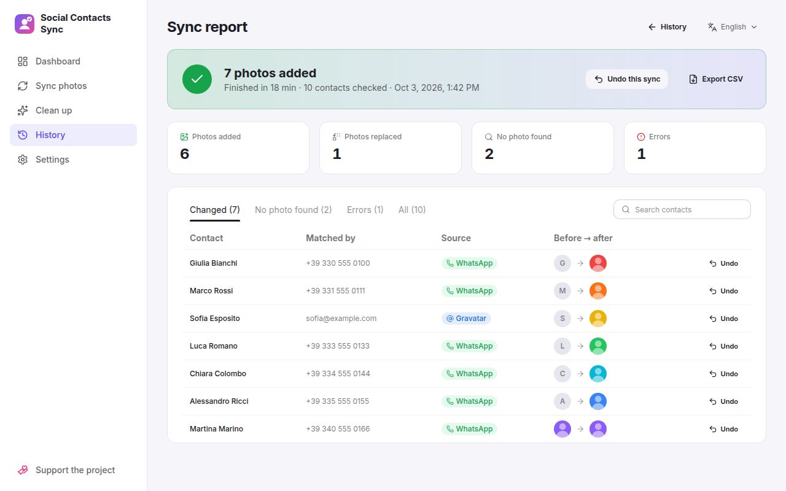
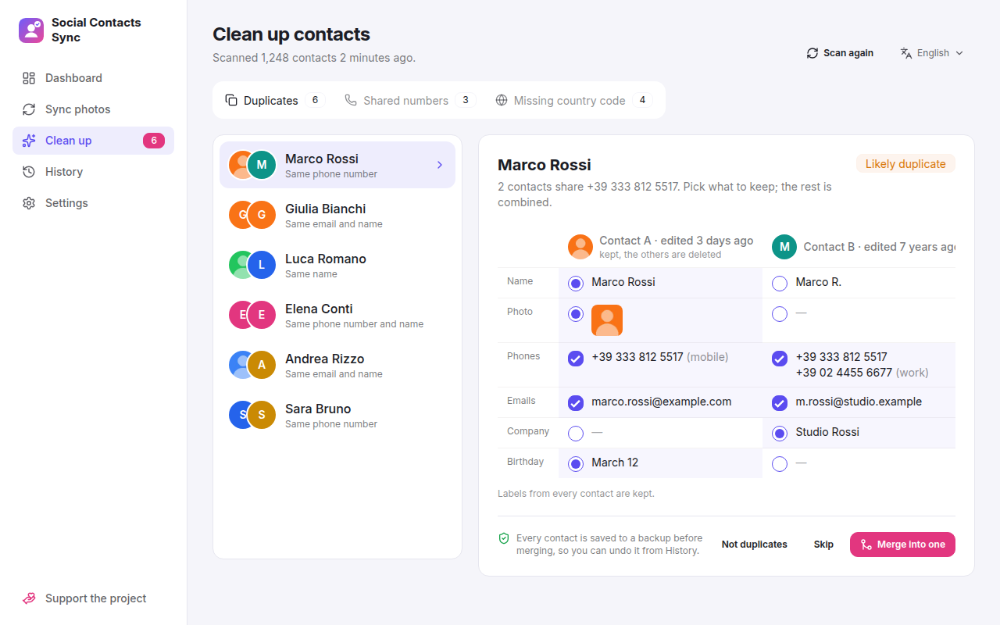
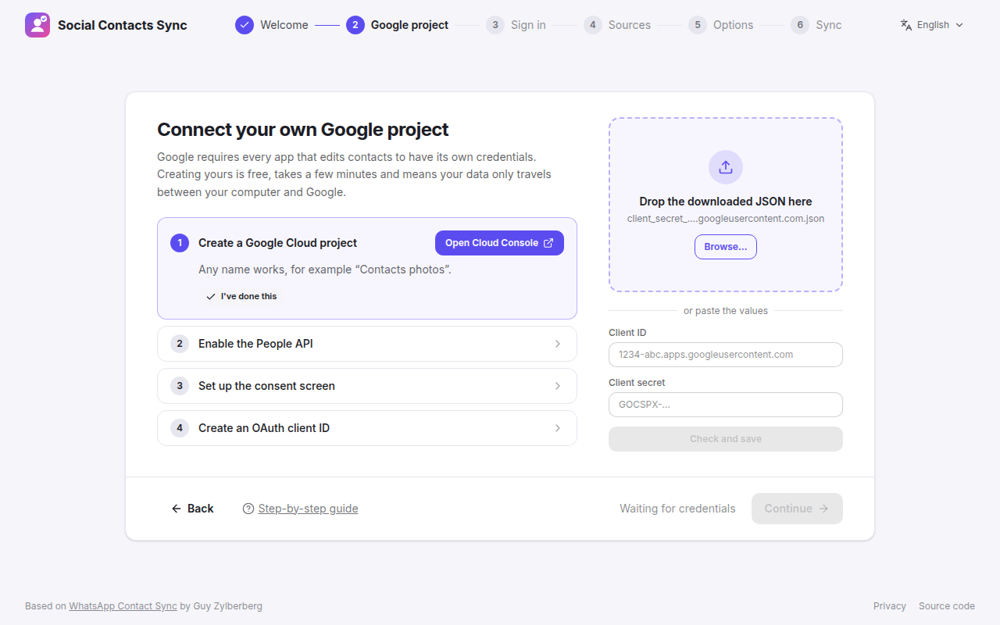
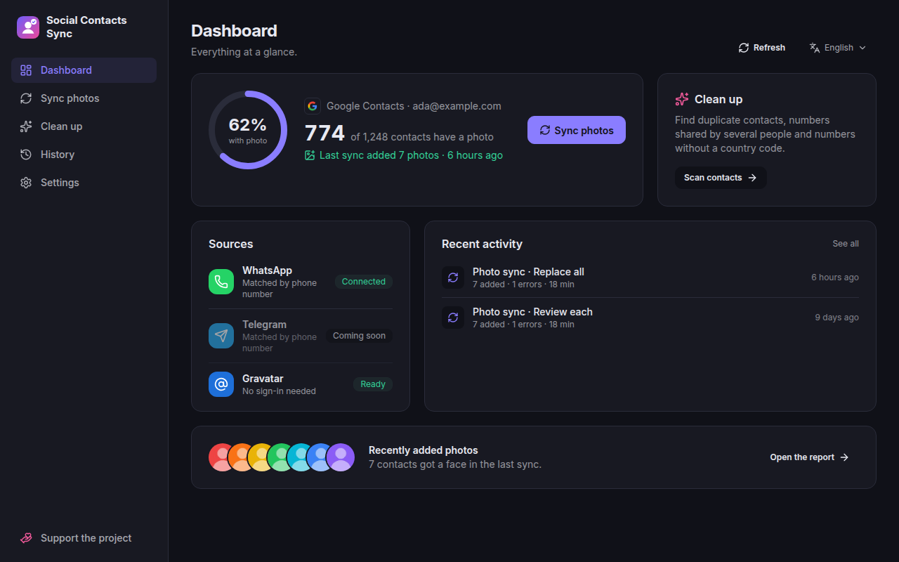
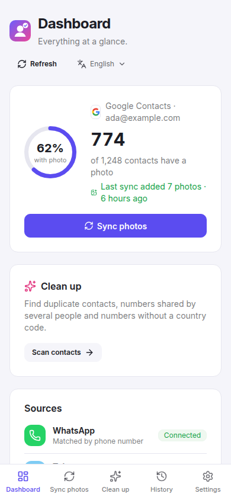

# Social Contacts Sync

<p align="center">
    
</p>

<p align="center">
    <b>Give every contact a face.</b><br/>
    Fill your Google Contacts with your contacts' profile photos from WhatsApp, Telegram, Gravatar
    and their social profiles, and tidy up duplicates on the way. Free, open source, and private:
    it runs on your computer.
</p>

<p align="center">
    <a href="https://github.com/easly1989/social-contacts-sync/releases/latest"></a>
    <a href="https://github.com/easly1989/social-contacts-sync/actions/workflows/ci.yml"></a>
    <a href="LICENSE"></a>
</p>

> Social Contacts Sync is a fork of
> [WhatsApp Contact Sync](https://github.com/guyzyl/whatsapp-contact-sync) by
> **Guy Zylberberg**, extended with a desktop app, more photo sources and contact
> clean-up. All credit for the original idea and project goes to its author:
> [support him too](https://www.buymeacoffee.com/guyzyl).

<p align="center">
    
</p>

## Features

- **Photos from your sources.** WhatsApp and Telegram (matched by phone number)
  and Gravatar (matched by email), in the priority order you choose. Only your
  existing Telegram contacts are read; nothing is added to your account.
- **Profile links.** The X, Telegram, YouTube, Bluesky, Mastodon and GitHub
  profiles saved on a contact give it their public picture, with no sign-in.
  Instagram, Facebook and LinkedIn can be turned on too, unofficially. Add a
  link right from a sync report's "No photo found" list, or while reviewing.
- **You stay in control.** Fill in only missing photos, replace them all, or
  review each one with the keyboard.
- **Nothing changes without a way back.** Every sync has a report and can be
  undone, as a whole or one contact at a time.
- **Clean up.** Find duplicate contacts and merge them field by field, find
  numbers saved on different people, and add missing country codes. Every
  change is backed up and can be undone from History.
- **Desktop app for Windows, Linux and macOS.** Download and run, with no Docker or
  server. A setup wizard walks you through connecting your own Google project,
  and sign-ins are kept encrypted with your system's keychain.
- **English and Italian; light, dark or system theme.**

| Sync photos | Report and undo |
|---|---|
|  |  |
| **Clean up duplicates** | **Setup wizard** |
|  |  |

<p align="center">
    
    
</p>

## Download

Get the latest version from the
[releases page](https://github.com/easly1989/social-contacts-sync/releases/latest):

| System | Package | Updates |
|---|---|---|
| Windows | `…-portable.exe` (no installation) or `…-setup.exe` | installer: automatic · portable: notification |
| Linux | `.AppImage` (no installation) or `.deb` | AppImage: automatic · deb: notification |
| macOS | universal `.dmg` | notification |

The packages are not code-signed yet:

- **Windows:** SmartScreen may warn on the first launch; choose *More info → Run anyway*.
- **macOS:** right-click the app, choose *Open*, then *Open Anyway* in *System Settings → Privacy & Security*.
- **Linux:** the app starts without Chromium's sandbox, because recent Ubuntu
  releases block it for AppImages. That's acceptable here because the window only
  shows the app's own local pages; everything else opens in your browser.

## Getting Started

1. **Start the app.** The portable `.exe` and the AppImage keep their settings
   next to themselves; installed versions use your user folder.
2. **Connect your own Google project.** Google requires every app that edits
   contacts to have its own credentials. Creating yours is free and takes a few
   minutes; the wizard links each page of the Google Cloud Console and checks
   the result. See the [step-by-step guide](docs/google-setup.md).
3. **Sign in to Google** in your browser.
4. **Link WhatsApp** by scanning a QR code, like WhatsApp Web, and/or **sign in
   to Telegram** with your phone number and the code Telegram sends you.
   Gravatar and profile links need no sign-in.
5. **Sync photos** from the dashboard, and look at **Clean up** for duplicates.

Google allows about 40 photo updates per minute, so a large address book takes a
while; the app shows progress and an estimate.

## Support the Project

Social Contacts Sync is free. If it saved you an evening of copying photos,
consider a small donation:

<p>
    <a href="https://buymeacoffee.com/easly1989"></a>
    <a href="https://paypal.me/carloruggiero"></a>
    <a href="https://buy.stripe.com/8x26oAeqA7h6dPk80hfbq00"></a>
    <a href="https://liberapay.com/amon2126/donate"></a>
    <a href="https://github.com/sponsors/easly1989"></a>
</p>

And please support the author of the original project:

<a href="https://www.buymeacoffee.com/guyzyl"></a>

## Credits

- [**WhatsApp Contact Sync**](https://github.com/guyzyl/whatsapp-contact-sync)
  by [Guy Zylberberg](https://github.com/guyzyl): the original project this app
  grew from, and its hosted service at [whasync.com](https://whasync.com).
- [whatsapp-web.js](https://github.com/pedroslopez/whatsapp-web.js),
  [Google People API](https://developers.google.com/people),
  [Gravatar](https://gravatar.com), [Electron](https://www.electronjs.org),
  [Vue](https://vuejs.org), [daisyUI](https://daisyui.com) and
  [Lucide](https://lucide.dev).
- Social Contacts Sync is maintained by **Carlo Ruggiero** —
  [easly1989.github.io](https://easly1989.github.io).

Licensed under the original project's [licence](LICENSE): Apache 2.0 with the
Commons Clause (free to use, not for sale). See the
[privacy policy](web/src/pages/Privacy.vue) for what the app stores and where it
connects.

---

## Self-Hosting the Web Version

The same app also runs as a web server (Node.js or Docker), for example on a home
server. In this mode Google credentials come from the environment and sessions are
kept in memory.

### Run Locally

In order for the backend to function, it requires an OAuth 2.0 client ID and secret.\
Since (for obvious reasons) this is a private app, you will need to create one for your own.\
You can see instructions on how to do that [here](https://developers.google.com/workspace/guides/create-credentials).\
Once you do that, create the file `server/.env`, and set the following environment variables:

- `GOOGLE_CLIENT_ID`
- `GOOGLE_CLIENT_SECRET`
- `TELEGRAM_API_ID` and `TELEGRAM_API_HASH` (optional, from [my.telegram.org](https://my.telegram.org)) to enable the Telegram source

You also need to add the following **Authorized Redirect URI** to your OAuth 2.0 client in the [Google Cloud Console](https://console.cloud.google.com) based on how you are running the app:

EXAMPLES:
- Local dev: `http://localhost:8080/api/google_callback`
- Docker (port 80): `http://localhost/api/google_callback`
- Production: `https://<your-domain>/api/google_callback`

Once that's done, you can go ahead and run the app:

```bash
# Run backend
cd server
npm install
npm run dev

# Run web app
cd web
npm install
npm run dev
```

The server build uses TypeScript 7. Both packages also install Microsoft's
`@typescript/typescript6` compatibility package under the `typescript` alias
because `ts-node` and `vue-tsc` still require the JavaScript compiler API.
The `@typescript/native` alias provides TypeScript 7's `tsc` executable.

### Docker

There are 3 different `Dockerfile`s for this app:

- [`Dockerfile`](Dockerfile) - This is an image containing both the backend and the web app
- [`Dockerfile`](web/Dockerfile) - An image containing only the web app
- [`Dockerfile`](server/Dockerfile) - An image containing only the backend

In order to build and run the complete app, you need to run the following commands:

```bash
docker build -t social-contacts-sync .
docker run --rm -it -p 80:10000 --env-file server/.env social-contacts-sync
```

### Deploy on Render

The GitHub Actions workflow publishes the full application to GitHub Container
Registry after every successful push to `main`. Make the resulting package
public in GitHub's package settings, then configure a Render **Web Service**
from the image:

- Image: `ghcr.io/easly1989/social-contacts-sync:latest`
- Health check path: `/api/`
- `GOOGLE_CLIENT_ID` and `GOOGLE_CLIENT_SECRET`: your Google OAuth values
- `SESSION_SECRET`: a long, random secret
- `TELEGRAM_API_ID` and `TELEGRAM_API_HASH` (optional): your Telegram app from
  [my.telegram.org](https://my.telegram.org), to enable the Telegram source
- `ENFORCE_PAYMENTS=false`

Render provides `PORT` automatically; do not override it. Add
`https://whasync-latest.onrender.com/api/google_callback` as an authorized
redirect URI in the Google Cloud OAuth client.

This service runs the frontend, API and WebSocket in one container. A service
that sleeps or is restarted ends an in-progress WhatsApp sync, so use an
always-on host for long synchronizations.

In order to build the seperate images for the backend and frontend, execute the following commands from the projects main directory:

```bash
docker build -t social-contacts-sync-backend --env-file server/.env -f server/Dockerfile .
docker build -t social-contacts-sync-web -f web/Dockerfile .
```

## Desktop App Details

The [`desktop/`](desktop) folder packages the server and the web app into an
Electron app for Windows, Linux and macOS. It runs everything locally: the
server listens on `127.0.0.1` only, and Google sign-in opens in your default
browser.

Settings live in a `config.env` file, which you can edit by hand:

| Build | `config.env` and data |
|---|---|
| Windows portable `.exe`, Linux AppImage | next to the executable (`config.env` + `social-contacts-sync-data/`) |
| Windows installer, `.deb`, macOS | the OS user data folder |
| any | the folder in `SCS_DATA_DIR`, if set |

On first start a setup wizard guides you through creating your own Google
OAuth client (type **Desktop app**, see [the guide](docs/google-setup.md)),
checks it with Google and saves it to `config.env` (`GOOGLE_CLIENT_ID`,
`GOOGLE_CLIENT_SECRET`); then you sign in to Google and link WhatsApp.
WhatsApp Web runs in an installed Chrome, Edge, Chromium or Brave. If none is
installed, Chrome for Testing is downloaded once into the data folder.

The app stays signed in between launches, unless you turn off
**Settings → General → Remember sign-ins** (`REMEMBER_SIGN_INS=false` in
`config.env`). The data folder holds:

| Item | Contents |
|---|---|
| `google-token.enc` | the Google sign-in, encrypted (AES-256-GCM) |
| `secret.key` | the key for `google-token.enc`, itself protected by the OS keychain (DPAPI, Keychain, libsecret/kwallet) |
| `whatsapp/` | WhatsApp's linked-device session |
| `telegram-session.enc` | the Telegram sign-in, encrypted like the Google one |
| `history/` | past syncs with the photos they changed, for reports and undo (kept 90 days) |
| `history/cleanup/` | backups of merged contacts (all their fields and photos), for undo (kept 90 days) |
| `cleanup.json` | clean-up choices, such as groups marked *Not duplicates* |
| `logs/` | server logs |

**Settings** shows these folders and lets you sign out of Google, unlink
WhatsApp, check for updates, and **delete all local data**: that signs out,
removes `config.env` and the data folder, and restarts the app on the setup
wizard. Your Google contacts are not touched. A portable folder copied to another computer can't
decrypt the Google sign-in; you just sign in again.

### Releases

Every `v*` tag publishes a [GitHub Release](https://github.com/easly1989/social-contacts-sync/releases)
built by the [release workflow](.github/workflows/release.yml), which launches each
package before publishing it (tags with a `-`, like `v0.2.0-beta.1`, are
pre-releases). Push the tag, or draft the release on GitHub with a new tag:
the workflow then adds the packages to it and keeps its title and notes. See
[Download](#download) for the packages and how they update.

### Desktop Development

```bash
cd desktop
npm install
npm run dev     # builds server, web and desktop, then starts the app
npm test        # unit tests
npm run pack    # unpacked build for this OS in desktop/dist
npm run test:e2e  # launches the packaged app (Linux needs a display, e.g. xvfb-run)
```

## Development

### Tests

Every pull request runs the [CI workflow](.github/workflows/ci.yml): server
build and unit tests, web type-check and build, a smoke test of the built
server, a Docker build and browser end-to-end tests. The end-to-end tests mock
the backend inside the browser, so they need no WhatsApp or Google account; the
screenshots they take are posted on the pull request.

```bash
cd server && npm test             # unit tests
cd web && npm run build && npm run test:e2e   # end-to-end (Playwright)
```

Run `npx playwright install chromium` once before the first end-to-end run.

### Keeping the Fork in Sync

This repository is a fork of [guyzyl/whatsapp-contact-sync](https://github.com/guyzyl/whatsapp-contact-sync).
The [`Upstream sync`](.github/workflows/upstream-sync.yml) workflow checks the
original repository on the 1st of every month (or when started by hand from the
Actions tab):

- new upstream commits are merged into the `upstream-sync` branch and offered as
  a pull request labelled `upstream-sync` — merge it with **Create a merge
  commit**, never squash or rebase;
- if the merge conflicts, an issue labelled `upstream-conflict` lists the files
  and the commands to resolve it; it closes itself after the next clean sync.

The workflow needs a fine-grained personal access token stored as the
`UPSTREAM_SYNC_TOKEN` repository secret, limited to this repository with
read & write access to Contents, Pull requests, Issues and Workflows (pull
requests opened with the default `GITHUB_TOKEN` would not run CI).
